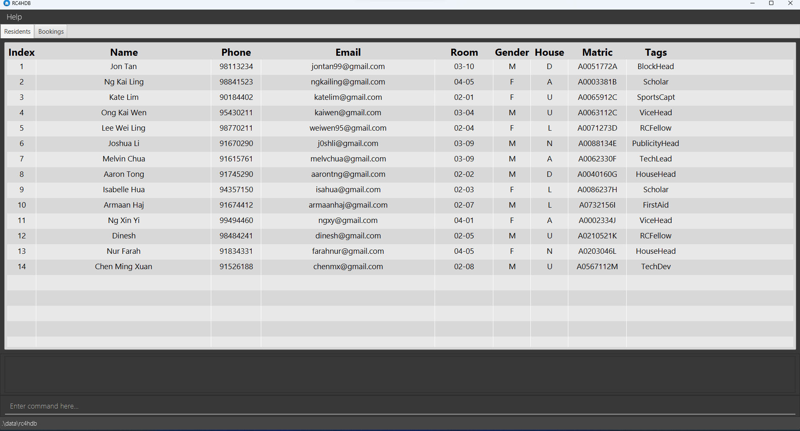

RC4HDB is a **desktop app for managing RC4 housing related information, optimized for use via a Command Line Interface** (CLI) while still having the benefits of a Graphical User Interface (GUI). If you can type fast, RC4HDB can be a convenient and intuitive way to facilitate your day-to-day workflow as a RC4 housing management staff.

## Table of Contents

* [Introduction to RC4HDB]()
* [Using this guide]()
* [Quick start]()
* [Features]()
  * [Getting help]()
  * [Modifying residents]()
    * [Adding a resident `add`]()
    * [Editing an existing resident `edit`]()
    * [Deleting an existing resident `delete`]()
    * [Clearing all residents `clear`]()
    * [Resident field format]()
  * [Viewing residents]()
    * [Listing all residents `list`]()
    * [Finding residents `find`]()
    * [Showing resident fields `show`]()
    * [Hiding resident fields `hide`]()
  * [File management]()
    * [Creating a new data file `file create`]()
    * [Deleting an existing data file `file delete`]()
    * [Switching data file `file switch`]()
    * [Importing from CSV file `import`]()
    * [Exporting to CSV file `export`]()
    * [CSV file format]()
  * [Data management]()
    * [Saving data]()
    * [Editing data file]()
  * [Keyboard shortcuts]()
  * [Accessing command history]()
  * [Exiting RC4HDB `exit`]()
* [FAQ]()
* [Glossary]()
* [Authors]()
* [Command Summary]()

 test 

 
Test

--------------------------------------------------------------------------------------------------------------------

## Quick start

1. Ensure you have Java `11` or above installed in your Computer.

1. Download the latest `rc4hdb.jar` from [here](https://github.com/AY2223S1-CS2103T-W12-3/tp/releases/).

1. Copy the file to the folder you want to use as the _home folder_ for your RC4HDB.

1. Refer to the [Features](#features) below for details of on how to use RC4HDB.

<!--- 1. Double-click the file to start the app. The GUI similar to the below should appear in a few seconds. Note how the app contains some sample data. 
 --->

--------------------------------------------------------------------------------------------------------------------

## Features

**:information_source: Notes about the command format:** 

* Words in `UPPER_CASE` are the parameters to be supplied by the user. 
  e.g. in `add n/NAME`, `NAME` is a parameter which can be used as `add n/John Doe`.

* Items in square brackets are optional. 
  e.g `n/NAME [t/TAG]` can be used as `n/John Doe t/friend` or as `n/John Doe`.

* Items with `…`​ after them can be used multiple times including zero times. 
  e.g. `[t/TAG]…​` can be used as ` ` (i.e. 0 times), `t/friend`, `t/friend t/family` etc.

* Parameters can be in any order. 
  e.g. if the command specifies `n/NAME p/PHONE_NUMBER`, `p/PHONE_NUMBER n/NAME` is also acceptable.

* If a parameter is expected only once in the command but you specified it multiple times, only the last occurrence of the parameter will be taken, unless otherwise specified. 
  e.g. if you specify `p/12341234 p/56785678`, only `p/56785678` will be taken.

* Extraneous parameters for commands that do not take in parameters (such as `help`, `list`, `exit` and `clear`) will be ignored. 
  e.g. if the command specifies `help 123`, it will be interpreted as `help`.
  
---
