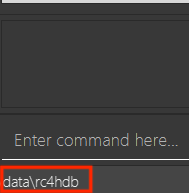

#### ← [Back to Menu](../UserGuide.md)

To provide a streamlined way of managing **RC4** related data, **RC4HDB** provides users with the ability to organise their files using our file management commands.

**RC4HDB** currently supports the following file management functionalities:
* [**Creation**](#creating-a-new-data-file--file-create) of new data folders
* [**Deletion**](#deleting-an-existing-data-file--file-delete) of old data folders
* [**Switching**](#switching-to-a-different-data-file--file-switch) between different data folders
* [**Importing**](#importing-from-csv-file--file-import) of resident data from a [CSV](glossary.md#csv) file.

:information_source: All file commands operate in the [data directory]().

---

### Finding your data

**RC4HDB** stores your data in a **main** data folder named `data`, which can be found in the same folder where you placed the `rc4hdb.jar` file. Within the **main** data folder, resident and venue data is stored in **sub** data folder(s). The default data folder that all copies of **RC4HDB** start out with is the `rc4hdb` folder.

Inside your data folder, there should be two [JSON](glossary.md#json) files, `resident_data.json` and `venue_data.json`, which store your **resident** and **venue** data respectively.

To find out which **sub** data folder is currently open, look at the **footer**, that can be found at the bottom of the application interface as shown in the image below, where the current **sub** data folder that is open is `rc4hdb`.

[Back to Top](#back-to-menu)

---

### Editing your data file

After familiarising yourself with **RC4HDB**, you are welcome to update data directly by editing the `resident_data.json` and `venue_data.json` found in your [**sub**](#finding-your-data) data folder. However, do take note that this is not the recommended method to edit data.

:exclamation: **Caution:**
If your changes to the data file makes its format invalid, RC4HDB will discard all data and start with an empty data 
file at the next run.

[Back to Top](#back-to-menu)

---

### Saving your data

RC4HDB saves your data after every command. There is no need to save manually.

[Back to Top](#back-to-menu)

---

### File Command Format:
* All file commands have a `FOLDER_NAME` field, which signifies the name of the **sub** data folder or the [CSV](glossary.md#csv) file to be targeted depending on the command that is being used.
* Do not include any file types in the `FOLDER_NAME`.
* The following symbols are not to be used in `FOLDER_NAME`.
    * Empty spaces
    * `.` dots
    * `/` forward slashes
    * `\ ` backslashes

### Examples:
* `rc4_data_2022` is a valid `FOLDER_NAME`.
* `rc4_data_2022.json` is an invalid `FOLDER_NAME` due to the inclusion of the file type, `.json`.
* The following are invalid `FOLDER_NAME` due to the inclusion of restricted symbols.
  * `rc4 data 2022` has empty spaces.
  * `rc4.data.2022` has dots.
  * `rc4/data/2022` has forward slashes.
  * `rc4\data\2022` has backslashes.

[↑ Back to Top](#back-to-menu)

---

### Creating a new data folder : `file create`

Creates a new [**sub**](#finding-your-data) folder with the specified `FOLDER_NAME`, if such a folder does not exist. After creating a new folder, RC4HDB will then create **fresh** data file to store **venue** and **resident** data.

Format: `file create FOLDER_NAME`
* Does not create a new folder if the folder already exists.

:information_source: `FOLDER_NAME` must follow this [format](#file-command-format).

Examples:
* `file create rc4_data_2022` will create a new folder named `rc4_data_2022` with fresh data **resident** and **venue** data files.

[↑ Back to Top](#back-to-menu)

---

### Deleting an existing data folder : `file delete`

RC4HDB provides users with the ability to delete their [**sub**](#finding-your-data) data folders when they no longer require them.

Format: `file delete FOLDER_NAME`
* Does not delete the folder if it is currently open. You may switch to a different folder before deleting the previously open folder.

:information_source: `FOLDER_NAME` must follow this [format](#file-command-format).

Examples:
* `file delete rc4_data_2022` will delete the `rc4_data_2022` folder, along with the **resident** and **venue** data files inside the folder.

[↑ Back to Top](#back-to-menu)

---

### Switching to a different data folder : `file switch`

**RC4HDB** provides users with the ability to switch between different [**sub**](#finding-your-data) data folders.

Format: `file switch FOLDER_NAME`
* Does not create a new folder if the specified folder does not exist.

:information_source: `FOLDER_NAME` must follow this [format](#file-command-format).

Examples:
* `file switch rc4_data_2022` will switch the currently used folder to `rc4_data_2022`.

[↑ Back to Top](#back-to-menu)

---

### Importing resident data from CSV file : `file import`

**RC4HDB** provides users with the ability to import data from [CSV](glossary.md#csv) files. In order for RC4HDB to find your files, place them in the [**main**](#finding-your-data) data folder.

Format: `file import FOLDER_NAME`

:information_source: The csv file that you want to have imported must follow this [format](#csv-file-format). 

Examples:
* `file import residents` will import the data from `residents.csv` into a new **resident** data file which can be found in the `residents` folder in the **main** data folder.

[↑ Back to Top](#back-to-menu)

---

### CSV file format

:information_source: All fields must adhere to this [format](modifying-resident-data.md#format-for-resident-fields). 

Format:
* For clarity, the table column headers have been included. **DO NOT** include them in your **CSV** file.
* All fields are mandatory, apart from `TAGS`, where users to input a `NIL`, which is **not** case-sensitive.

| NAME         | PHONE_NUMBER | EMAIL                   | FLOOR-UNIT | GENDER | HOUSE  | MATRIC_NUMBER | TAGS                |
|--------------|--------------|-------------------------|------------|--------|--------|---------------|---------------------|
| John Doe     | 91234567     | johnDoe@example.com     |    5-8     | M      | D      | A9876543B     | NIL                 |
| Maggie Smith | 98765432     | maggieSmith@example.com |    4-1     | F      | A      | A3456789B     | WelfareHead Captain |

[↑ Back to Top](#back-to-menu)

---
